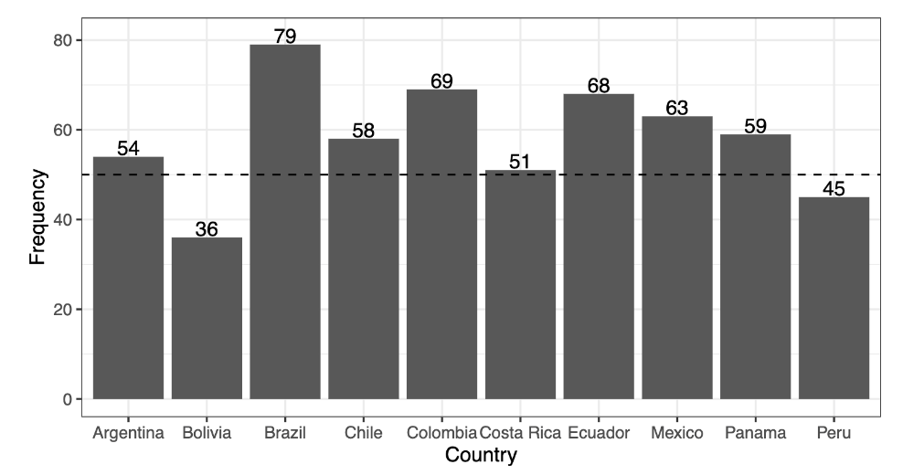
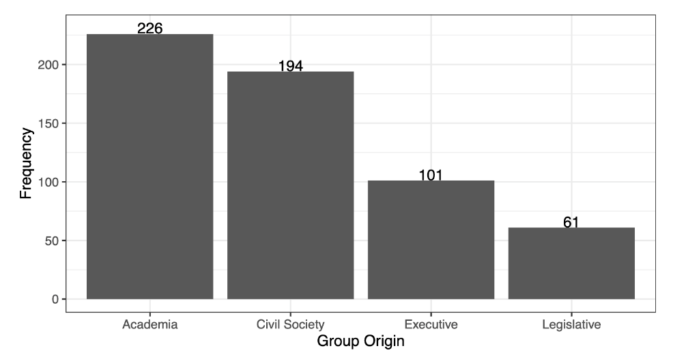
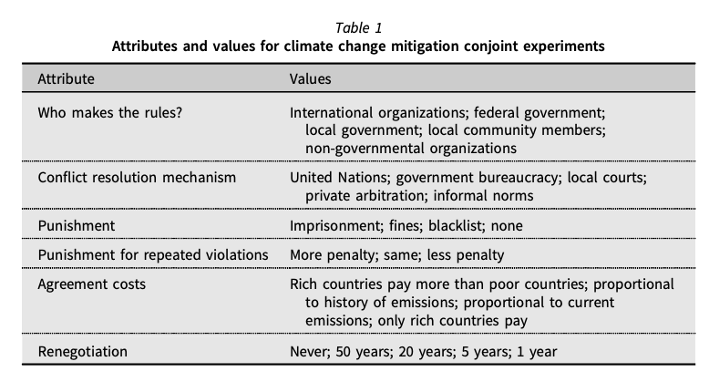
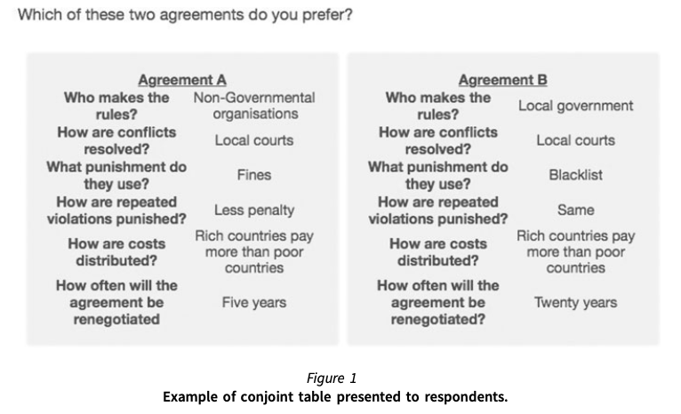
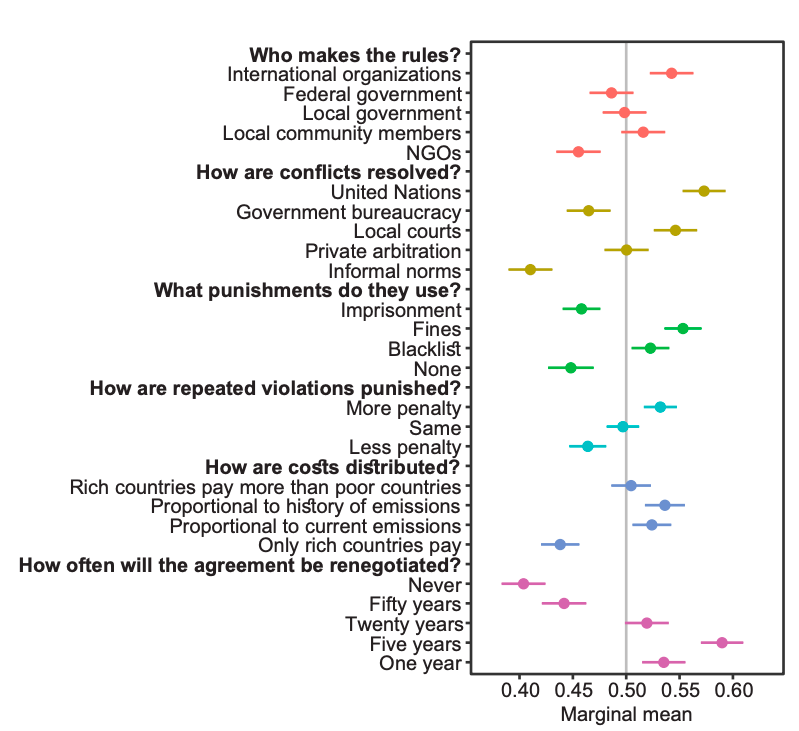
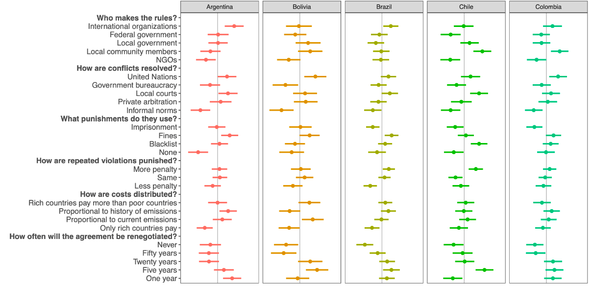
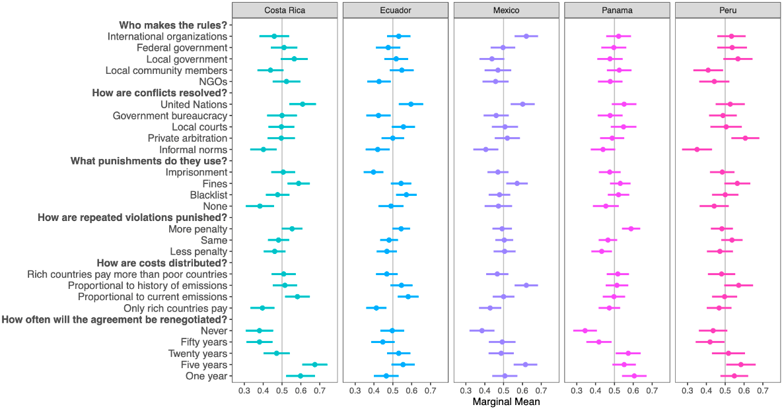
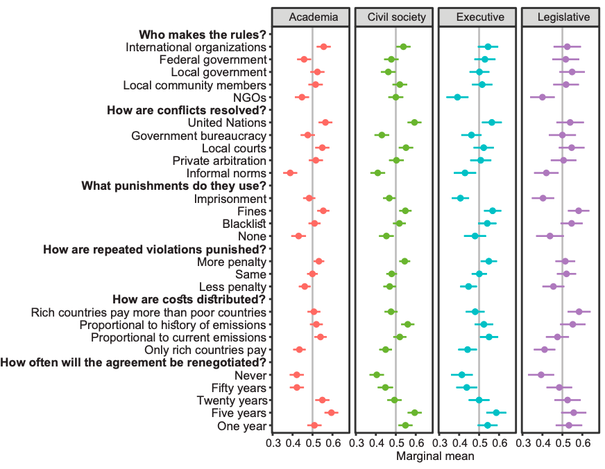

```{r xaringan-themer, include=FALSE, warning=FALSE}
options(htmltools.dir.version = FALSE)
list.of.packages <- c("xaringan", "xaringanthemer")
new.packages <- list.of.packages[!(list.of.packages %in% installed.packages()[,"Package"])]
if(length(new.packages)) install.packages(new.packages)
library(xaringanthemer)
style_mono_accent(
  base_color = "#1c5253",
  header_h1_font_size = "2.25rem",
  header_h2_font_size = "1.85rem",
  header_font_google  = google_font("Josefin Sans"),
  text_font_google    = google_font("Montserrat", "300", "300i"),
  text_font_size      = "1.35rem",
  code_font_google    = google_font("Fira Mono")
)
```

# Motivation

* While there is a broad scientific consensus about the consequences of climate
  change...

--

* We have achieved little in terms of CO<sub>2</sub> reduction and halting deforestation (Rogelj et al. 2010; Rosen, 2015; Victor et al. 2017)

--
* Scepticism about future outcomes of multilateral climate talks

--

* Scientists believe current efforts may not be sufficient to meet the target of 2<sup>o</sup>C temperature
rise above pre-industrial levels (Jordan et al. 2015)

--

* _Why have these talks fallen short of academic and political expectations?_

---

# Motivation

* Growing literature on which institutional characteristics lead to successful climate agreements (e.g., Bechtel and Scheve 2013)

--

* But most of it focus exclusively on the public opinion in developed countries  (e.g., Bechtel et al. 2019; Mildenberger and Tingley 2019)

--

* However, elites exert substantial influence on climate-related decisions, either as veto players or by "societal steering"

--

* As the Paris Agreement relies on Nationally Determined Contributions (NDCs), elite behaviour is key to the success of multilateral treaties

--

* Elite preferences, mainly in the developing world, are not well understood

--

* _What do elites believe climate change agreements should be like?_

---

# What we do

* We run a conjoint experiment with 654 respondents from 10 Latin American countries

* Elites: Academics, members of the executive power, legislators, businesspeople, and members of non-governmental organisations

* Countries: Argentina, Bolivia, Brazil, Chile, Colombia, Costa Rica, Ecuador, Mexico, Panama, and Peru

* For each country, we collected the profiles of 100 members of the executive branch, 100 members of the legislative branch, 150 academics in the energy sector, and 150 members of the civil society

* We then sampled these profiles until we achieved a minimum of 10% of responses within each group

---

# What we do

* We create 5,500 hypothetical climate change agreements

* Six attributes: 
  - (1) which organisations define the rules
  - (2) how would conflicts be resolved
  - (3) what punishment should be applied to rule-breakers
  - (4) how should repeated violations be sanctioned
  - (5) which countries should bear the costs of the agreement
  - (6) how often should the agreement be renegotiated

* Each respondents chose their favourite agreement in 5 paired choices

---

# What we find

* Interviewees prefer international organisations to design local climate policies


--

* Favour imposing increasing fines on violators


--

* Renegotiating agreements every 5 years


--

* Want both international institutions and local courts to mediate conflicts


--

* Distrust NGOs


--

* Consistently reject informal norms as an instrument to solve disputes


--

* Decision cycles and inconsistent regional preferences


---

# Contributions

* We contribute to three strands of the literature

* First, we add experimental evidence to studies on institutional design
  - We show institutional support varies markedly according to elite type and country of origin
  - _Climate negotiations may not reach a unique preferred solution_


--

* Second, flexible regime designs are decisive to foster international cooperation

  - Non-hierarchical international rulings (Keohane and Victor 2011)
  - Incomplete contracts when compliance is hard (Mildenberger and Tingley, 2019)


---

# Contributions

* Third, we present novel information on Latin American elite behaviour regarding climate institutions

  - Neither centralisation nor polycentrism (Ostrom 2004)
  - Heavier reliance on the state instead of bottom-up solutions

---

# Data

* From 1<sup>st</sup> October to 12<sup>th</sup> November, 2018 we built a prospective dataset from elite members of 10 Latin American countries

* For each profile, in each country, we aimed at surveying:

1. 10 members of the Executive branch
2. 10 members of the Legislative branch
3. 15 Civil society
4. 15 Academics

* Our dataset had 10 times that size

* From 12<sup>th</sup> November to 5<sup>th</sup> December, 2018, we run a telephone and online survey
  - Goal: 500 respondents
  - Achieved: 654 interviewees

---

# Descriptive statistics

.center[]

---

# Descriptive statistics

.center[]

---

# Descriptive statistics

* *Issues*:

* We contacted more than fifty elite members for all countries but Bolivia and Peru

* Data collection for members of the Legislative branch was below the original target, but above the minimum mark of 5 for each country

* We exceeded the sample size in all the remaining states to compensate for the lower _n_

---

# Research design

* **Conjoint experiment**: statistical technique that allows individuals to express their preferences on multiple attributes of a single topic (Hainmueller et al, 2014)

* Individuals are presented with two hypothetical scenarios, A and B, each containing a series of characteristics

* As the attributes are randomized and individuals choose between different pairs of hypothetical scenarios, we can estimate how individuals value each of the conjoined elements

* We presented 5 pairs to each respondents with the following attributes:

---

# Research design

.center[]

---

# Research design

.center[]

---

# Main results



---

# Main results

* The results do not conform to strictly top-down or bottom-up approaches, _but to a combination of these attributes_

* While elites favor solutions provided at the macro level, they are also open to input from other government actors and local groups

* Further, the rejection on non-governmental organisations points to a discredit of self-governing arrangements as a means to deal with global warming

* In line with Latin America's long reliance on the state to
design and implement policies

---

# Results by country



---

# Results by country



---

# Results by country

* Disaggregated data confirm that elites have a generalised preference for international agencies to solve conflicts

* They also strongly dislike informal norms

* Preference for a positive role by federal and local governments

* _However, some of the regional preferences are a by-product of sample aggregation_

*  Latin American elites do not have a consensus on which organisations should provide the rules: some prefer IOs, others central governments, others local governments

* Problem: _decision cycles_

---

# Results by elite type



---

# Results by elite type

* Different elites hold similar views about how conflicts should be resolved, what punishment to apply to lawbreakers (fines and blacklisting), and the duration of the agreements

* Differences emerge in two of the six attributes:

  - Academics and members of the civil society are sceptical about the role of federal government; members of the government have a more positive view 
  - Members of the legislative branch prefer rich countries to bear the larger part of agreement costs

---

# Discussion and conclusion

* We examine which attributes of local climate change mitigation treaties Latin American elites support

* International organisations to resolve disputes, imposing increasing fines, renegotiating agreements every 5 years

* Distrust civil society (NGOs and informal norms)

* Results do not match the typical dichotomy of top-down versus bottom-up approaches

* Large heterogeneity in the responses: while elites are interested in incorporating new actors, it is unclear _which ones_

---

# Future research

* Forced choices are not exactly like choosing any bundle

* Unpack rules associated with international agreements from domestic politics constraints (constitutions, party dynamics, etc)

* Qualitative interviews, more fine-grained information about the mechanisms behind elite choices

* Examine if the Latin American public has the same opinion on multilevel arrangements as do the elites; if not, why so?

---

class: center, middle, inverse

# Thank you very much! :)

---

# Let's keep in touch!

* Danilo Freire:

  - [danilofreire@gmail.com](mailto:danilofreire@gmail.com)
  - <http://danilofreire.github.io>

* Umberto Mignozzetti:

  - [umberto.mig@gmail.com](mailto:umberto.mig@gmail.com)
  - <http://umbertomig.com>

* David Skarbek:

  - [david_skarbek@brown.edu](mailto:david_skarbek@brown.edu)
  - <http://davidskarbek.com>
